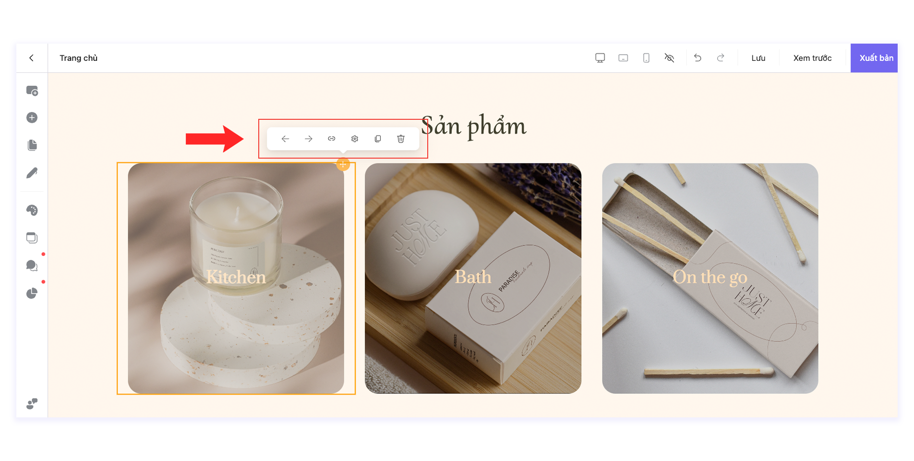

# Cột

Cột là lớp bên trong trong Hàng. Hàng sẽ chứa Cột và các Phần tử bên trong nó. Có thể thêm nhiều Cột ở trong 1 Hàng. Bạn có thể tạo nhiều Cột vào trong một Hàng hoặc 1 Cột cụ thể.

## Cách thêm Cột&#x20;

**Bước 1:** Tại vị trí mà bạn muốn thêm cột, bấm chọn **Thêm bố cục hoặc khối được xây dựng sẵn.**

<figure><figcaption></figcaption></figure>

**Bước 2:** Chọn bố cục mà bạn mong muốn để tạo các Cột bên trong hàng và kéo thả phần tử vào các Cột tương ứng.

<figure><figcaption></figcaption></figure>

## Cài đặt Cột

**Bước 1:** Di chuột vào cột cho đến khi thấy biểu tượng  ở góc phải trên cùng của cột và bấm chọn biểu tượng đó để mở thanh chỉnh sửa.

<figure><figcaption></figcaption></figure>

**Bước 2:** Chỉnh sửa Cột.

_Hướng dẫn theo thứ tự hiển thị từ trái sang phải_

* **Dịch phần tử sang trái/ phải:** Di chuyển cột sang trái/phải cột khác
* **Gắn link:** Thêm Sự kiện hoặc Chuyển đổi cho Cột
* **Cấu hình cột:** Chỉnh sửa kích thước nội dung/kiểu/hiển thị/nâng cao cho Cột
* **Nhân bản:** Nhân bản cột trong hàng
