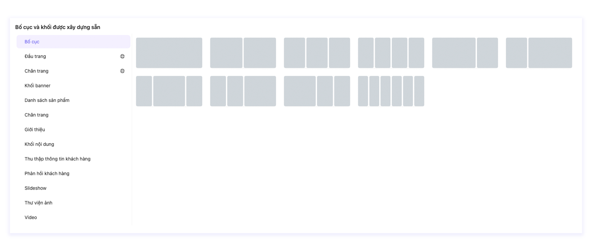
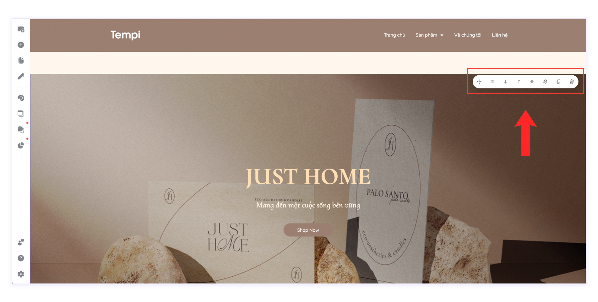

# Hàng

**Hàng** là khối cơ bản chính của việc xây dựng thiết kế trên Tempi. **Hàng** chứa các loại bố cục và tất cả các phần tử khác bên trong nó. Để bắt đầu thiết kế trang của mình, trước tiên bạn cần phải thêm **Bố cục** để có thể kéo các phần tử vào bên trong Hàng.&#x20;

## Cách thêm Hàng

**Bước 1:** Tại vị trí mà bạn muốn thêm phần tử, bấm chọn **Thêm bố cục hoặc khối được xây dựng sẵn.**

<figure><figcaption></figcaption></figure>

**Bước 2:** Chọn bố cục mà bạn mong muốn để tạo các khối bên trong hàng và kéo thả phần tử vào các khối tương ứng.

<figure><figcaption></figcaption></figure>

## Cài đặt Hàng

**Bước 1:** Di chuột vào hàng để hiển thị thanh cài đặt nằm ở góc phải của Hàng.

<figure><figcaption></figcaption></figure>

**Bước 2:** Chỉnh sửa chung các khối trong Hàng.

_Hướng dẫn theo thứ tự hiển thị từ trái sang phải_

* **Chỉnh sửa bố cục Hàng:** Bạn có thể chọn nhanh bố cục có sẵn hoặc sửa bố cục thủ công theo đơn vị %
* **Di chuyển khối xuống dưới/lên trên:** Di chuyển khối xuống dưới hoặc lên trên mà không cần thiết kế lại
*   **Ẩn/Hiện trên thiết bị:** Cài đặt để khối Ẩn/Hiện trên Máy tính/Điện thoại

    
* **Cấu hình hàng:** Chỉnh sửa kích thước nội dung/kiểu/hiệu ứng/nâng cao cho Hàng
