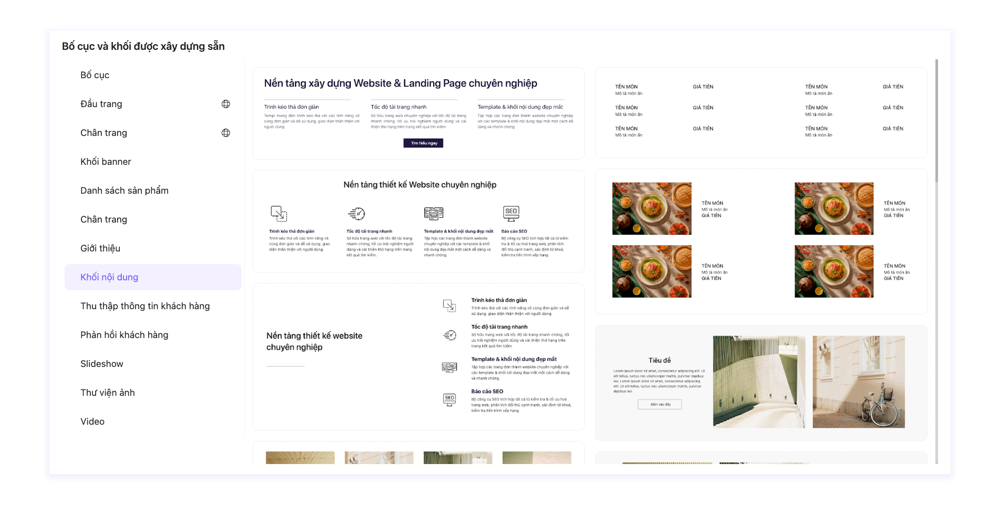

# Khối dựng sẵn

Khối dựng sẵn là các khối đã được chúng tôi xây dựng sẵn theo nhiều loại bố cục khác nhau. Sử dụng khối được xây dựng sẵn sẽ giúp bạn tiết kiệm tối đa thời gian thiết kế cho Website/Landing page của mình.&#x20;

## Cách thêm Khối dựng sẵn

Bước 1: Tại vị trí mà bạn muốn thêm phần tử, bấm chọn Thêm bố cục hoặc khối được xây dựng sẵn để mở danh sách Bố cục và Khối đã được chúng tôi xây dựng sẵn.

<figure><figcaption></figcaption></figure>

**Bước 2:** Chọn Khối mà bạn muốn sử dụng và chỉnh sửa tương tự như chỉnh sửa Hàng/Cột/Phần tử.

<figure><figcaption></figcaption></figure>


[hang.md](hang.md)



[cot.md](cot.md)



[phan-tu](phan-tu/)

