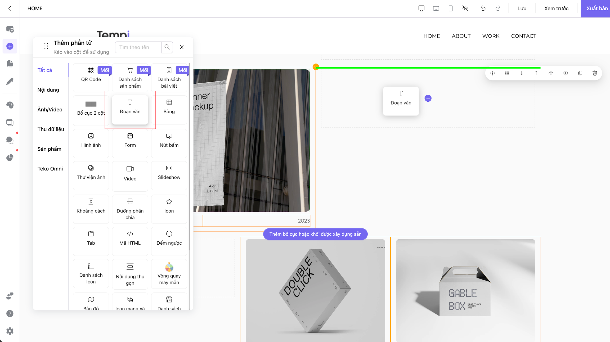
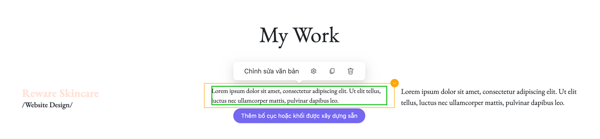

# Đoạn văn

### Cách thêm Đoạn văn 

Tại vị trí mà bạn muốn thêm đoạn văn, kéo phần tử **Đoạn văn** vào bố cục có sẵn. Khi vị trí hiển thị màu xanh (ảnh) thì có nghĩa là bạn có thể đặt phần tử vào vị trí đó.

<figure><figcaption></figcaption></figure>

### Cách cài đặt Đoạn văn 

Bấm vào phần tử Đoạn văn -> Bấm **Chỉnh sửa đoạn văn** rồi chỉnh sửa đoạn văn tuỳ ý.

<figure><figcaption></figcaption></figure>

Hướng dẫn theo thứ tự từ trái qua phải, từ trên xuống dưới:

<figure><figcaption></figcaption></figure>

* Chỉnh sửa màu của Đoạn văn
* Chỉnh sửa Tiêu đề 1/2/3,... Đoạn văn
* Lựa chọn phông chữ
* Chỉnh sửa cỡ chữ (Lựa chọn cỡ chữ có sẵn hoặc nhập cỡ chữ tuỳ ý)
* Khoảng cách trong Đoạn văn
* Căn chỉnh trái/giữa/phải/căn lề 2 bên
* Đánh dấu/Đánh số đầu dòng
* In đậm
* In nghiêng
* Gạch chân
* Gạch ngang
* Gắn link (Cài đặt Mở trang trong website hoặc Nhập liên kết)
* Cài đặt Hiệu ứng & Cài đặt Nâng cao

\
