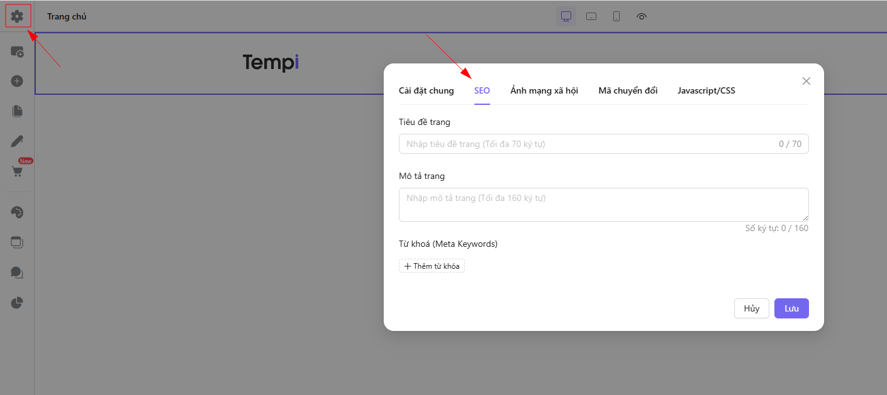

# Chỉnh sửa giao diện cho điện thoại

Chọn chế độ máy tính/điện thoại trên trình chỉnh sửa để tùy chỉnh tương ứng cho từng thiết bị

* Icon máy tính: Chỉnh sửa giao diện hiển thị trên máy tính
* Icon điện thoại: Chỉnh sửa giao diện hiển thị trên điện thoại
* Icon con mắt: Ẩn/hiện các phần tử đang sử dụng tính năng ẩn/hiện trên từng thiết bị tương ứng

<figure><figcaption></figcaption></figure>

Hầu hết các phần tử trên Tempi đều có hỗ trợ chỉnh sửa riêng kích thước (chiều rộng, chiều cao), cỡ chữ, bố cục hiển thị riêng cho máy tính và điện thoại, chi tiết như bảng dưới

<table><thead><tr><th width="183">Phàn tử</th><th width="433">Thuộc tính hỗ trợ chỉnh sửa riêng cho máy tính/điện thoại</th></tr></thead><tbody><tr><td>Tất cả phần tử</td><td>

<ul><li>Margin</li></ul><ul><li>Padding</li></ul></td></tr><tr><td>Danh sách sản phẩm</td><td>Cỡ chữ</td></tr><tr><td>QR code</td><td>Kích thước</td></tr><tr><td>Icon</td><td>Kích thước </td></tr><tr><td>Slideshow ảnh</td><td>

<ul><li>Chiều cao</li></ul><ul><li>Số lượng phần tử hiển thị trên 1 hàng</li></ul></td></tr><tr><td>Video</td><td>Chiều rộng</td></tr><tr><td>Button</td><td>Kích thước Cỡ chữ</td></tr><tr><td>Gallery</td><td>
Layout

Số cột

Khoảng cách giữa các ảnh
</td></tr><tr><td>PDF viewer</td><td>Kích thước </td></tr><tr><td>Tab</td><td>Cỡ chữ</td></tr><tr><td>Countdown</td><td>Cỡ chữ</td></tr><tr><td>Câu hỏi thường gặp</td><td>

<ul><li>Chiều rộng</li></ul><ul><li>Cỡ chữ</li></ul><ul><li>Khoảng cách giữa các mục</li></ul></td></tr><tr><td>Nội dung thu gọn</td><td><ul><li>Cỡ chữ</li><li>Khoảng cách với nội dung</li></ul>
 
</td></tr><tr><td>Icon mạng xã hội</td><td>

<ul><li>Kích thước khung</li></ul><ul><li>Kích thước biểu tượng</li></ul><ul><li>Khoảng cách</li></ul></td></tr><tr><td>Danh sách cửa hàng</td><td>Khoảng cách trên khi scoll</td></tr><tr><td>Progress</td><td>

<ul><li>Chữ: Cỡ chữ, khoảng cách dòng</li></ul><ul><li>Số: Cỡ chữ, khoảng cách dòng</li></ul><ul><li>Kiểu bar: Chiều cao</li></ul></td></tr><tr><td>Danh sách bài viết</td><td>

<ul><li>Dạng lưới: Số hàng, số lượng bài viết trên 1 hàng, khoảng cách giữa các bài viết, khoảng cách giữa các mục</li></ul><ul><li>Dạng danh sách: Số lượng bài viết hiển thị, khoảng cách giữa các bài viết, khoảng cách giữa các mục</li></ul><ul><li>Dạng trượt: Số lượng bài viết trên 1 hàng, khoảng cách giữa các bài viết, khoảng cách giữa các mục</li></ul></td></tr><tr><td>Trang sách</td><td><ul><li>Chiều cao</li></ul><ul><li>Chiểu rộng </li></ul></td></tr><tr><td>Danh sách</td><td>
Số lượng mục trên 1 hàng

Khoảng cách giữa các mục

Khoảng cách giữa các hàng
</td></tr><tr><td>Văn bản</td><td>

<ul><li>Cỡ chữ</li><li>Khoảng cách dòng</li></ul><ul><li>Khoảng cách chữ</li></ul></td></tr></tbody></table>
