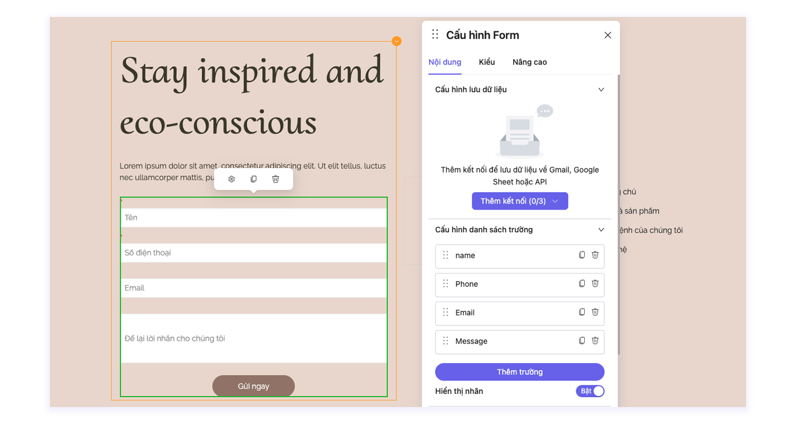
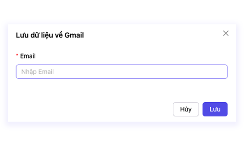

# Lưu data về Email

**Bước 1:** Mở trang bạn muốn lưu data về Email. Click trực tiếp vào phần tử Form thông tin để mở **Bảng cài đặt -> Nội dung -> Cấu hình lưu dữ liệu.**

<figure><figcaption></figcaption></figure>

**Bước 2:** Bấm vào **Thêm kết nối (0/3) -> Email** và nhập email mà bạn muốn liên kết với Form thông tin này.

<figure><figcaption></figcaption></figure>

* **Nhập địa chỉ email** mà bạn muốn liên kết với form thông tin
* Bấm **Lưu** để hoàn thành lưu liên kết
