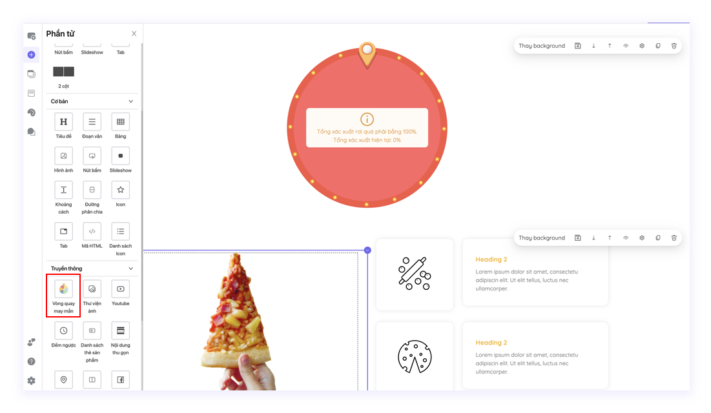
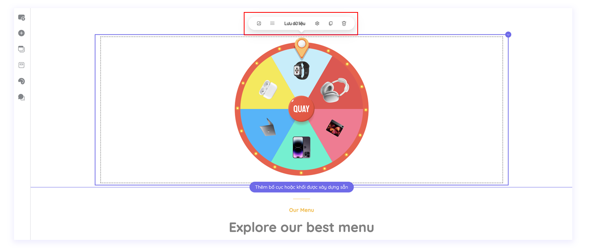

# Vòng Quay May Mắn

## 1. **Cách thêm Phần tử**

**Bước 1 - Thêm phần tử:** Kéo phần tử Vòng quay may mắn tương tự như cách thêm các phần tử khác[ **tại đây.**](../cac-thanh-phan-co-ban-tren-tempi/phan-tu.md)

<figure><figcaption>
Giao diện hiển thị Vòng quay may mắn khi chưa được cấu hình phần thưởng
</figcaption></figure>

**Bước 2 - Mở bảng cài đặt:** Click trực tiếp vào phần tử **Vòng quay may mắn** để mở bảng cài đặt.

## 2. Cài đặt Phần tử

<figure><figcaption></figcaption></figure>

### **Chỉnh sửa ảnh:**

* Nền: Tải ảnh lên từ máy tính hoặc dán đường dẫn ảnh để chỉnh sửa hình nền của vòng quay may mắn. Nhập độ xoay của hình nền mà bạn muốn tại mục Xoay (độ).
* Viền: Tải ảnh lên từ máy tính hoặc dán đường dẫn ảnh để chỉnh sửa viền của vòng quay may mắn.
* Nút: Tải ảnh lên từ máy tính hoặc dán đường dẫn ảnh để chỉnh sửa nút quay của vòng quay may mắn.
* Mũi tên: Tải ảnh lên từ máy tính hoặc dán đường dẫn ảnh để chỉnh sửa hình nền của vòng quay may mắn. Nhập độ xoay của mũi tên trúng thưởng mà bạn muốn tại mục Xoay (độ).

### **Lưu dữ liệu:**

Bạn có thể lưu dữ liệu của người chơi qua 03 hình thức liên kết là Email, Google Sheet và API.

<figure><figcaption></figcaption></figure>


[luu-data-ve-email.md](form-thong-tin/luu-data-ve-email.md)



[luu-data-ve-api.md](form-thong-tin/luu-data-ve-api.md)



[luu-data-ve-google-sheets.md](form-thong-tin/luu-data-ve-google-sheets.md)


### **Cấu hình giải thưởng:**

_Hướng dẫn theo thứ tự từ trên xuống dưới_

* **Góc quay trúng thưởng:** Là vị trí mà mũi tên trúng thưởng sẽ được đặt tuỳ vào góc độ mà bạn nhập.
* **Hướng giải thưởng:** Bạn có thể chọn hướng của giải thưởng là Dọc hoặc Ngang.
* **Hiển thị số lượt quay:** Click chuột vào biểu tượng  để bật hiển thị số lượt quay còn lại mà người chơi có thể bấm quay.

### Danh sách giải thưởng:

<figure><figcaption></figcaption></figure>

#### Chọn “+ Thêm phần quà” để mở cài đặt danh sách quà tặng:

* **Tên quà:** Nhập tên của phần quà
* **Tỉ lệ trúng thưởng:** Bạn có thể tuỳ chỉnh tỉ lệ trúng thưởng của từng phần quà theo thông số %
* **Liên kết API:** Thêm liên kết API theo hướng dẫn [tại đây](form-thong-tin/luu-data-ve-api.md)
* **Hình ảnh:** Bạn có thể tải ảnh của phần quà lên từ máy tính
* **Đường dẫn ảnh:** Bạn có thể dán đường dẫn của ảnh phần quà
* **Chiều rộng ảnh:** Độ lớn của ảnh được hiển thị theo thông số pixel
* **Số lượng giải thưởng:** Số lượng tối đa của giải thưởng

### Phản hồi:

<figure><figcaption></figcaption></figure>

Click chuột vào biểu tượng  để mở bảng cài đặt **Popup trúng thưởng:**

<figure><figcaption></figcaption></figure>

#### Bạn có thể cấu hình popup (Hướng dẫn theo thứ tự từ trên xuống dưới):

* **Tên:** Là tên của popup trúng thưởng
* **Hiển thị icon đóng popup:** Click chuột vào biểu tượng để bật hiển thị icon đóng popup bên trên cùng góc phải của popup
* **Hiển thị icon đóng popup:** Click chuột vào biểu tượng  để bật hiển thị icon đóng popup bên trên cùng góc phải của popup
* **Hiện khi vào trang:** Click chuột vào biểu tượng  để popup hiện lên khi vào trang
* **Hiện khi thoát trang:** Click chuột vào biểu tượng  để popup hiện lên khi thoát trang
* **Hiện khi cuộn đến:** Chọn tên của popup mà bạn đã lưu để popup đó hiện lên khi cuộn đến trên trang landing
* **Chiều rộng/Chiều cao:** Là kích thước hiển thị của popup được hiển thị theo thông số pixel
* **Màu backdrop:** Là màu của màn hình đằng sau khi popup hiển thị
* **Vị trí:** Là vị trí mà popup hiển thị trên trang Landing

Để chỉnh sửa ảnh trên Popup, bấm vào từng phần tử ảnh để chỉnh sửa.

Để chỉnh sửa văn bản trên Popup, bấm vào từng phần tử văn bản để chỉnh sửa.

#### Chỉnh sửa **Popup hết lượt/Popup hết quà** tương tự như Popup trúng thưởng.

### Điều kiện tham gia & trúng giải:

Chọn **Chỉnh sửa cấu hình form** để mở cài đặt cấu hình form.

<figure><figcaption></figcaption></figure>

Khi bạn Xác nhận cấu hình form thành công, người chơi cần nhập đủ thông tin trên form rồi mới được quay vòng quay may mắn.

### Giới hạn tham gia:

* **Giới hạn theo mỗi người chơi:** Giới hạn quay vòng quay may mắn của mỗi người chơi
* **Lượt tham gia tối đa:** Nhập số lần tối đa mà người chơi có thể quay vòng quay may mắn
* **Tính theo mốc thời gian cố định (với lựa chọn này, lượt chơi sẽ được tự động reset theo mốc thời gian bắt đầu được cài đặt bên dưới)**

<figure><figcaption></figcaption></figure>

•  **Lượt tham gia:** Số lần mà người chơi được quay vòng quay may mắn

• **Thời gian bắt đầu:** Mốc thời gian để tính lượt chơi được reset lại

• **Reset sau: N**hập số ngày/tuần/tháng mà bạn muốn lượt chơi được reset tính từ mốc thời gian bắt đầu mà bạn đã đặt ở trên

Tương tự, với lựa chọn Tính theo thời điểm tham gia, lượt chơi sẽ tự động reset theo thời điểm mà người chơi bắt đầu quay vòng quay may mắn.

<figure><figcaption></figcaption></figure>
