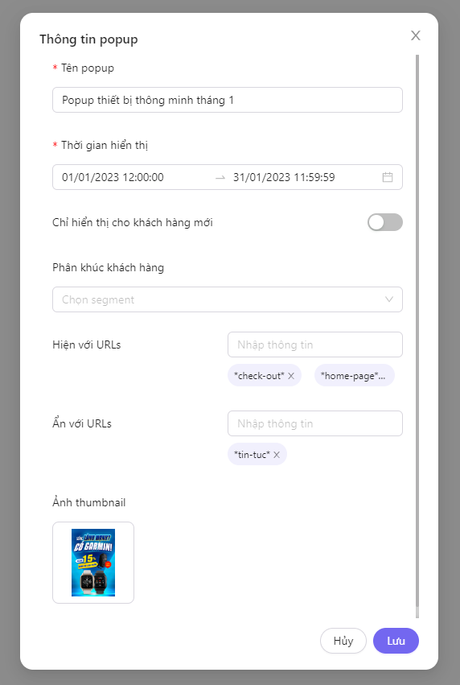

# Tạo mới popup

## Bước 1: Khai báo thông tin popup

<figure><figcaption></figcaption></figure>

* Tên popup (bắt buộc)
* Thời gian hiển thị (bắt buộc): chọn thời gian bắt đầu và kết thúc hiển thị của popup khi kích hoạt trạng thái hoạt động. Xem thêm [#trang-thai-popup-va-thoi-gian-hien-thi](quan-ly-popup.md#trang-thai-popup-va-thoi-gian-hien-thi "mention")
* Chỉ hiển thị cho khách hàng mới: nếu chọn bật sẽ chỉ hiển thị cho khách hàng truy cập website lần đầu tiên.
* Phân khúc khách hàng: chọn phân khúc khách hàng muốn hiển thị (tính năng đang trong giai đoạn thử nghiệm).
* Hiện với URLs: nhập giá trị các url của trang mà bạn muốn hiển thị popup, enter mỗi khi muốn thêm 1 chuỗi giá trị mới. Nếu để trống, popup sẽ hiển thị ở bất kỳ trang nào trên website của bạn khi khách hàng truy cập.
* Ẩn với URLs: nhập giá trị các url của trang mà bạn không muốn hiển thị popup. Enter mỗi khi muốn thêm 1 chuỗi giá trị mới.
* Ảnh thumbnail: tải lên ảnh đại diện để dễ phân biệt với các popup khác trong danh sách


🧙‍♂️Mẹo! Bạn có thể thêm kí tự \* để thiết lập điều kiện linh hoạt hơn. Ví dụ:&#x20;

abc: tìm kiếm chính xác&#x20;

\*abc\*: url có chứa chuỗi abc&#x20;

\*abc: url kết thúc bằng chuỗi abc&#x20;

abc\*: url bắt đầu bằng chuỗi abc



Bạn có thể truy cập để chỉnh sửa lại các thông tin đã khai báo bất cứ lúc nào tại màn hình thiết kế hoặc quản lý danh sách popup


Lưu thông tin để chuyển tiếp qua giao diện thiết kế popup

## Bước 2: Thiết kế popup

<figure><figcaption>
Kéo thả các phần tử để thiết kế nội dung popup theo mong muốn
</figcaption></figure>

Hướng dẫn sử dụng các phần tử bạn có thể xem thêm chi tiết tại [Broken link](broken-reference "mention")

## Bước 3: Thiết lập cài đặt nội dung và nâng cao của popup

<figure><figcaption></figcaption></figure>

* Tên popup
* Hiển thị icon đóng popup: Hiển thị icon X để thao tác đóng popup. Nếu không lựa chọn, người xem vẫn sẽ có thể đóng popup bằng cách click vào vị trí bất kỳ bên ngoài popup.
* Hiện khi vào trang: hiển thị popup khi người xem bắt đầu truy cập xem 1 trang
* Độ trễ: thiết lập đỗ trễ theo giây để hiển thị popup kể từ khi người xem truy cập vào trang ở trên
* Hiện khi thoát trang: hiển thị khi người xem có xu hướng rời bỏ trang
* Chiều rộng: thiết lập chiều rộng của khối popup theo pixel
* Chiều cao: thiết lập chiều rộng của khối popup, nếu để trống chiều cao của popup sẽ tự động điều chỉnh phù hợp theo các phần tử chứa trong khối
* Màu backdrop: chọn màu nền backdrop, khuyến khích chọn màu có độ trong suốt phù hợp
* Vị trí: lựa chọn vị trí sẽ hiển thị popup trong khung màn hình
* Khoảng cách: điều chỉnh lại khoảng cách giữa popup và lề tương ứng với vị trí hiển thị trong khung màn hình đã chọn ở trên
* Sự kiện hiển thị popup: khai báo các thông tin sự kiện chuyển đổi của Google Ads/Facebook Ads (nếu có)


Nâng cao: bạn có thể khai báo thêm 1 số tùy chỉnh nâng cao cho popup như padding, khung thời gian hiển thị, hiệu ứng hiển thị của popup tại tab Nâng cao


## Bước 4: Lưu và kích hoạt popup

<figure><figcaption>
Thao tác cho popup
</figcaption></figure>

* Lưu (1): lưu các thiết kế vào cấu hình popup đã thực hiện
* Cài đặt (2): cầi đặt nội dung và nâng cao của popup
* Chi tiết (3): cài đặt thông tin popup
* Trạng thái popup (4): kích hoạt hoặc vô hiệu popup. Xem thêm [#trang-thai-popup-va-thoi-gian-hien-thi](quan-ly-popup.md#trang-thai-popup-va-thoi-gian-hien-thi "mention")
* Đóng (5): đóng màn hình thiết kế popup hiện tại để trở về màn hình thiết kế website
