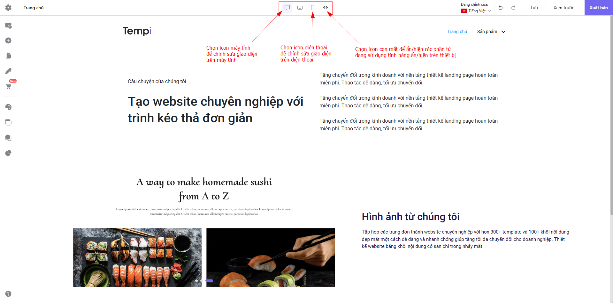

# Mua tên miền trực tiếp trên Tempi

### 1. Những lưu ý khi lựa chọn tên miền[​](https://tempi.vn/huong-dan/ten-mien/ten-mien/mua-ten-mien-truc-tiep-tren-tempi/#1-nh%E1%BB%AFng-l%C6%B0u-%C3%BD-khi-l%E1%BB%B1a-ch%E1%BB%8Dn-t%C3%AAn-mi%E1%BB%81n) 

Trước khi đi vào tìm hiểu cách mua tên miền cho website, bạn cần lưu ý một số _quy tắc_ trong cách lựa chọn tên miền:

* Tên miền không được vượt quá 63 ký tự, bao gồm cả phần .com.vn, .vn …
* Tên miền chỉ gồm các ký tự trong bảng chữ cái (a-z), các số (0-9) và dấu trừ (-).
* Các khoảng trắng và các ký tự đặc biệt trong tên miền khác đều không hợp lệ.
* Không thể bắt đầu bằng hoặc kết thúc tên miền bằng dấu trừ (-).
* Tên miền càng ngắn càng tốt, dễ nhớ, không gây nhầm lẫn, khó viết sai.
* Tên miền phải liên quan đến tên chủ thể và lĩnh vực hoạt động hoặc trùng với thương hiệu/ tên doanh nghiệp, hoặc tên doanh nghiệp ghép thêm tiếng Anh (ngành kinh doanh).
  * com.vn - Dành cho tổ chức, cá nhân hoạt động thương mại.
  * biz.vn - Dành cho các tổ chức, cá nhân hoạt động kinh doanh, tương đương với tên miền COM.VN.
  * edu.vn - Dành cho các tổ chức, cá nhân hoạt động trong lĩnh vực giáo dục, đào tạo.
  * gov.vn - Dành cho các cơ quan, tổ chức nhà nước ở trung ương và địa phương.
  * net.vn - Dành cho các tổ chức, cá nhân hoạt động trong lĩnh vực thiết lập và cung cấp các dịch vụ trên mạng.
  * org.vn - Dành cho các tổ chức hoạt động trong lĩnh vực chính trị, văn hoá, xã hội.
  * int.vn - Dành cho các tổ chức quốc tế tại Việt Nam.
  * ac.vn - Dành cho các tổ chức, cá nhân hoạt động trong lĩnh vực nghiên cứu.
  * pro.vn - Dành cho các tổ chức, cá nhân hoạt động trong những lĩnh vực có tính chuyên ngành cao.
  * info.vn - Dành cho các tổ chức, cá nhân hoạt động trong lĩnh vực sản xuất, phân phối, cung cấp thông tin.
  * health.vn - Dành cho các tổ chức, cá nhân hoạt động trong lĩnh vực dược, y tế.
  * name.vn - Dành cho tên riêng của cá nhân tham gia hoạt động Internet.
  * mil.vn - Dành cho các tổ chức quân đội và quốc phòng.

### 2. Hướng dẫn mua tên miền trực tiếp trên Tempi[​](https://tempi.vn/huong-dan/ten-mien/ten-mien/mua-ten-mien-truc-tiep-tren-tempi/#2-h%C6%B0%E1%BB%9Bng-d%E1%BA%ABn-mua-t%C3%AAn-mi%E1%BB%81n-tr%E1%BB%B1c-ti%E1%BA%BFp-tr%C3%AAn-tempi) 

**Bước 1:** Tại trang Dashboard tài khoản Tempi của bạn, vào mục **Tên miền**. Bấm **+ Đăng ký tên miền mới.**

<figure><figcaption></figcaption></figure>

**Bước 2:** Kiểm tra tên miền bạn muốn đăng ký.

Nhập tên miền bạn muốn đăng ký và bấm vào nút **Kiểm tra,** để kiểm tra xem tên miền đã có người sở hữu chưa.

<figure><figcaption></figcaption></figure>

Nếu tên miền chưa có người đăng ký, hệ thống sẽ hiển thị giá của tên miền trong vòng 01 năm

<figure><figcaption></figcaption></figure>

Ở đây, bấm **Đăng ký** để tiếp tục mua tên miền.

**Bước 3:** Điền thông tin mua tên miền mới.

<figure><figcaption></figcaption></figure>

Điền đầy đủ các thông tin trong phần **Nhập thông tin chủ thể**. Bấm **Tiếp tục thanh toán** để tiến hành thanh toán tên miền.

**Bước 4:** Chọn phương thức thanh toán phù hợp và hoàn tất quá trình mua tên miền.

<figure><figcaption></figcaption></figure>

Khi đã đăng ký tên miền thành công, màn hình của bạn sẽ hiển thị thông báo như sau:

Bấm vào **Danh sách tên miền** để đi đến trang quản lý tên miền của bạn.

<figure><figcaption></figcaption></figure>

**Bước 5:** Tại màn **Danh sách tên miền**, tên miền khi vừa được đăng ký sẽ ở trạng thái **Đang chờ tạo**. Thông thường sẽ cần chờ từ 30 phút đến 1 tiếng để tên miền được kích hoạt thành công.

<figure><figcaption></figcaption></figure>

*   Tên miền được kích hoạt thành công ở sẽ trạng thái **Đã kích hoạt**. Hệ thống sẽ tự động gửi thông tin tên miền của bạn về email. Vui lòng theo dõi email và tiến hành bổ sung hồ sơ theo hướng dẫn.

    \

    

\

_Lưu ý: Vui lòng **Bổ sung hồ sơ** để hoàn thiện quá trình đăng ký tên miền **trong vòng 3 ngày** kể từ khi tên miền của bạn ở trạng thái **Đã kích hoạt.**_\

Chi tiết cách **Bổ sung hồ sơ**

Tại màn **Danh sách tên miền,** bấm **Bổ sung hồ sơ.**

\

<figure><figcaption></figcaption></figure>

Sau đó thực hiện bổ sung hồ sơ theo từng bước được hướng dẫn.

Như vậy, bạn đã hoàn thiện quá trình mua tên miền trực tiếp trên Tempi. Thời gian xử lý hồ sơ sẽ diễn trong khoảng từ 1-2 ngày.

* Nếu hồ sơ hợp lệ, tên miền của bạn sẽ được hiển thị trạng thái **Hồ sơ hợp lệ.**
* Nếu hồ sơ không hợp lệ, tên miền của bạn sẽ được hiển thị trạng thái **Hồ sơ không hợp lệ.** Vui lòng liên hệ Tempi để được hỗ trợ xử lý.
* Tên miền khi chưa được kích hoạt thành công sẽ ở trạng thái **Lỗi khi tạo**.\

_Nếu gặp phải trường hợp này, bạn vui lòng liên hệ với Tempi để được hỗ trợ kích hoạt tên miền._\

Sau khi mua tên miền thành công, bạn có thể sử dụng tên miền này để xuất bản Website/Landing Page của bạn.

Tại trình kéo thả Website/Landing Page của bạn, bấm **Xuất bản trang** và chọn **Sử dụng tên miền đã sở hữu.** Chọn tên miền bạn vừa mua và bấm **Xuất bản** để hoàn tất Website/Landing Page.

<figure><figcaption></figcaption></figure>

Vậy là bạn đã xuất bản thành công Website/Landing Page với tên miền mua trên Tempi.[​](https://tempi.vn/huong-dan/ten-mien/ten-mien/mua-ten-mien-truc-tiep-tren-tempi/#c%C3%A1ch-2-ti%E1%BA%BFn-h%C3%A0nh-mua-t%C3%AAn-mi%E1%BB%81n-khi-xu%E1%BA%A5t-b%E1%BA%A3n-trang)

