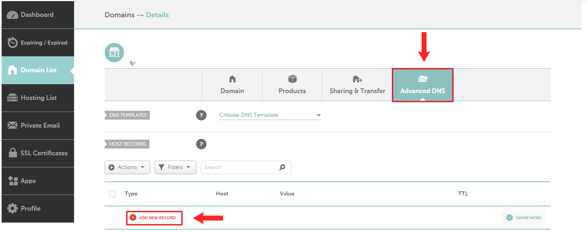

# Trỏ tên miền từ Namecheap

Bạn truy cập vào tài khoản của bạn ở https://ap.www.namecheap.com/, vào mục **Account** và chọn **Domain List.**

**Bước 1:** Tiếp theo, chọn tên miền mà bạn muốn cập nhật bản ghi, bấm nút để truy cập vào phần quản lý tên miền đó.

**Bước 2:** Chọn mục **Advanced DNS -> Add New Record** để tạo bản ghi tên miền.

<figure><figcaption></figcaption></figure>

## Trỏ tên miền chính

Tạo 2 bản ghi trỏ tên miền chính về hosting của Tempi**.** Bấm vào .png>) để thêm bản ghi.

<figure><figcaption></figcaption></figure>

Record: CName\
Host: www\
Target: kdc.tempi.vn

Host record: @\
Type (Loại): A\
Value (Giá trị): 103.126.157.33

## Trỏ tên miền phụ

Giả sử tên miền chính của bạn là tenmiencuaban.vn, và bạn muốn tạo một tên miền phụ là abc.tenmiencuaban.vn.&#x20;

Chọn tên miền chính bạn muốn cài đặt. Sau đó bạn tạo một bản ghi mới và điền các giá trị như sau:

Record :CName\
Host : abc\
Target: kdc.tempi.vn

Bấm vào .png>) để thêm bản ghi.

<figure><figcaption></figcaption></figure>

Sau khi đã trỏ thành công tên miền về hosting của Tempi, bạn cần tiếp tục [tạo và xác thực tên miền tại Tempi.](tao-va-xac-thuc-ten-mien-lai-tempi.md)

\
